## Scikit_learn库的分析与实践
#### 作者：李忠赫
#### github账户：<https://github.com/Lizhonghe0214>
`LZH`文件夹下包含8个`.py`文件和1个数据集文件夹`datasets`，每个`.py`文件均可独立运行  
`.py`文件包含了对`sklearn`库功能的分析运用以及利用`sklearn`库进行的简单机器学习和深度学习实践
#### 以下是对具体`.py`文件和数据集的说明
#### 1. `scikit_learn_data_preprocessing.py`
- 该文件包含对sklearn库在数据预处理方面的实操
- `sklearn.__version__`可查看版本号
- `CountVectorizer()`可将文本数据转换为为词频矩阵
- `StandardScaler()`可对数据进行标准化
- `MinMaxScaler()`可对数据进行归一化
- `SimpleImputer(strategy='mean')`可对缺失值进行填充，参数`strategy='mean'`表示使用均值进行填充
- `X_train, X_test, y_train, y_test = train_test_split(X, y, test_size=0.25, random_state=42)`将数据集分割为训练集和测试集，前两位必需参数为预测变量`X`和响应变量`y`，参数`test_size=0.25`表示按训练集：测试集=4：1进行分割
***
#### 2. `scikit_learn_model_selection_tuning.py`
- 该文件包含对sklearn库在模型选择和调优方面的实操
- `LogisticRegression(max_iter=200)`实例化逻辑回归模型，参数`max_iter=200`表示最大迭代次数为200次
- `cross_val_score(model, X, y, cv=5)`可计算交叉验证得分，参数`cv=5`表示进行5折交叉验证
- `GridSearchCV(model, param_grid, cv=5)`可对模型和超参数组合进行网格搜索，寻找最佳的超参数组合
- `accuracy_score(y_test, y_pred)`可计算预测准确率
- `SelectKBest(f_classif, k=2)`可进行特征选择，参数`f_classif`表示选择计算特征与目标变量之间的ANOVA F-value来评估特征，参数`k=2`表示选择2个最佳特征
***
#### 3. `scikit_learn_supervised_learning.py`
- 该文件包含对sklearn库在监督学习方面的实操
- `mean_squared_error(y_test, y_pred)`用于计算均方误差MSE
- `X, y = make_classification(n_samples=100, n_redundant=0, n_repeated=0, n_features=2, n_classes=2, random_state=42)`用于生成分类数据集，参数`n_samples=100`指定生成100个样本，`n_redundant=0`指定生成的数据集中不包含冗余特征，`n_repeated=0`指定生成的数据集中不包含重复特征，`n_features=2`指定生成2个特征，`n_classes=2`指定为2分类
- `SVC(kernel='linear')`实例化支持向量分类器模型，参数`kernel='linear'`表示使用线性核函数
- `confusion_matrix(y_test, y_pred)`可生成混淆矩阵
- `DecisionTreeClassifier()`实例化决策树分类器模型
- `RandomForestClassifier(n_estimators=100)`实例化随机森林分类器模型，参数`n_estimators=100`表示随机森林中包含100棵决策树
- `MLPClassifier(hidden_layer_sizes=(100, 50), max_iter=1000, random_state=42)`实例化多层感知机分类器模型，参数`hidden_layer_sizes=(100, 50)`指定MLP包含2层隐藏层，神经元数量分别为100和50，参数`max_iter=1000`表示最大迭代次数为1000次
- `GradientBoostingClassifier(n_estimators=100, learning_rate=0.1, random_state=42)`实例化梯度提升分类器，参数`n_estimators=100`指定训练100个弱学习器，参数`learning_rate=0.1`指定学习率为0.1
***
#### 4. `scikit_learn_unsupervised_learning.py`
- 该文件包含对sklearn库在无监督学习方面的实操
- `X, _ = make_blobs(n_samples=300, centers=4, cluster_std=0.6, random_state=0)`用于生成聚类数据集，参数`n_samples=300`指定生成300个样本，参数`centers=4`指定生成4个聚类中心，参数`cluster_std=0.6`指定每个聚类的标准差为0.6
- `KMeans(n_clusters=4, n_init='auto')`实例化K均值聚类算法，参数`n_cluster=4`指定将数据划分为4个簇，参数`n_init='auto'`表示自动设置算法迭代次数
- `PCA(n_components=2)`实例化主成分分析，参数`n_components=2`指定将数据降维到二维
- `TruncatedSVD(n_components=2)`实例化截断奇异值分解，参数`n_components=2`指定将数据降维到二维
***
#### 5. `scikit_learn_advanced_application.py`
- 该文件包含对sklearn库的高级应用的实操
- `TfidfVectorizer()`可将文本数据转换为TF-IDF特征矩阵
- `MultinomialNB()`实例化多项式朴素贝叶斯分类器模型
- `KNeighborsClassifier(n_neighbors=3)`实例化K近邻分类算法，参数`n_neighbors=3`指定考虑其最近的3个邻居
***
#### 6. `sklearn_tips.py`
- 该文件包含对sklearn库使用时的19个tips
- 详细说明可见文件内部的注释
***
#### 7. `machine_learning_BigJob.py`
- 利用sklearn库的决策树模型进行测井自动分层，内容包含自主设计实现的GR特征预处理算法
- 使用的sklearn库的模块包含： 
`from sklearn.model_selection import train_test_split` 
`from sklearn.tree import DecisionTreeClassifier` 
`from sklearn.metrics import accuracy_score`
- 数据集来自`datasets`文件夹内的`logging_data.xlsx`和`logging_test_data.xlsx`
- 可视化GR曲线（红色曲线） 
  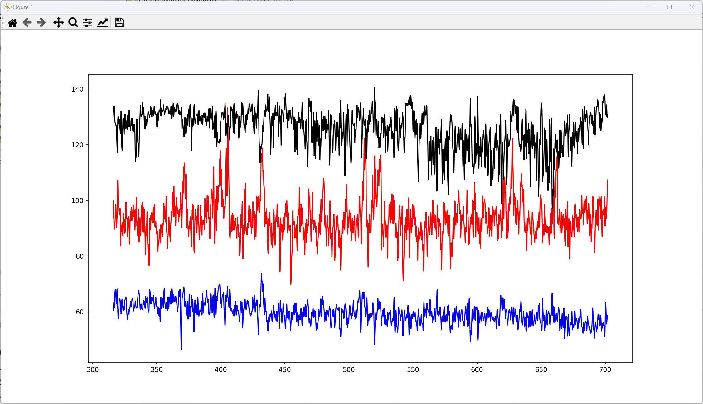 
  可视化实际分层（绿色竖虚线） 
  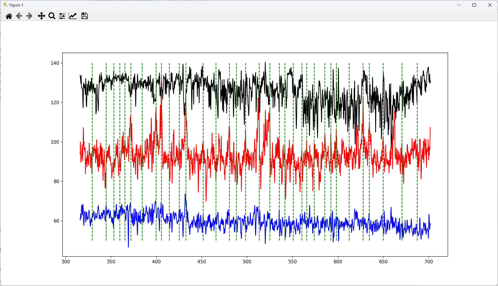 
  可视化算法预处理分层依据（黑色竖虚线） 
  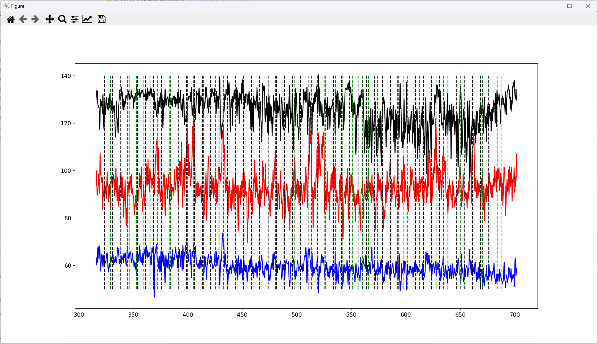 
  可视化算法预处理后的训练集GR曲线 
  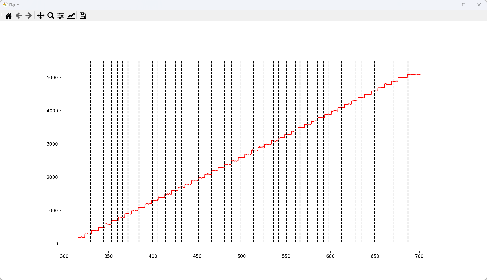 
  可视化算法预处理后的测试集GR曲线 
  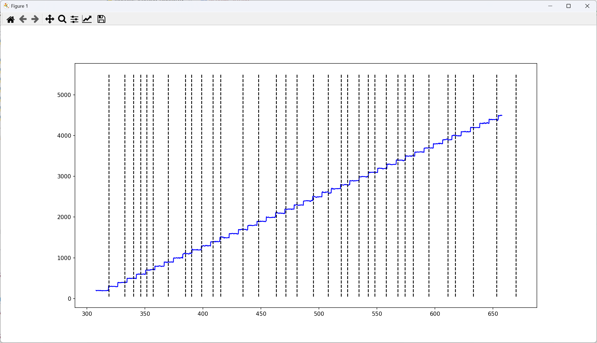 
- 验证集上的结果 
  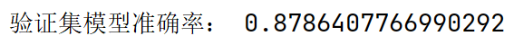 
- 测试集上的结果 
  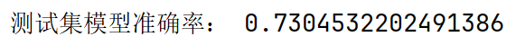 
***
#### 8. `RNN_traffic_prediction.py`
- 采用pytorch框架，并以sklearn库为辅助，利用循环神经网络进行出租车费用流量预测
- 使用的sklearn库的模块包含： 
  `from sklearn.preprocessing import MinMaxScaler` 
  `from sklearn.metrics import mean_squared_error`
- 数据集来自`datasets`文件夹内的`green_tripdata_2016-12.csv`
- 可视化每60分钟的出租车费用流量数据 
  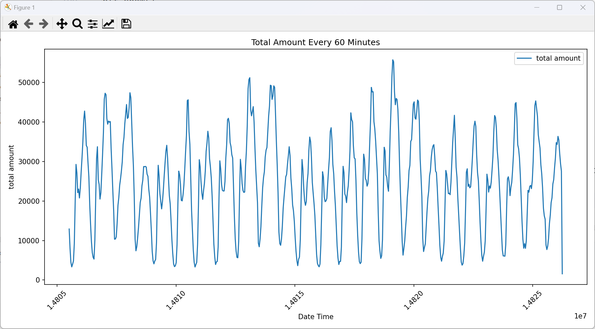 
  可视化LSTM预测出租车费用流量数据 
  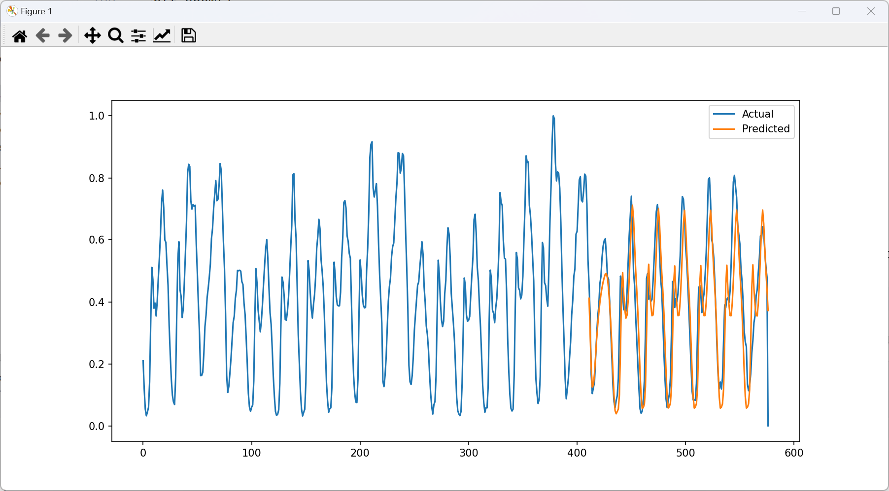 
  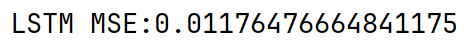 
  可视化RNN预测出租车费用流量数据 
  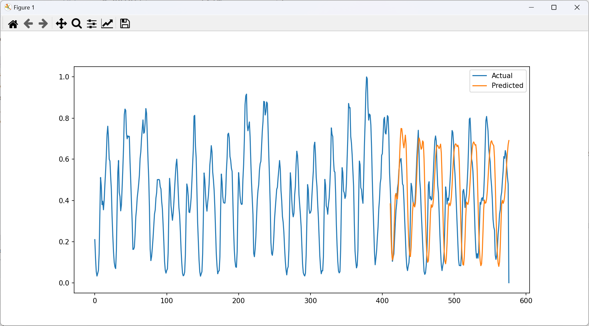 
  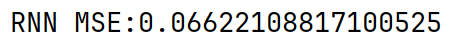 
  可视化GRU预测出租车费用流量数据 
  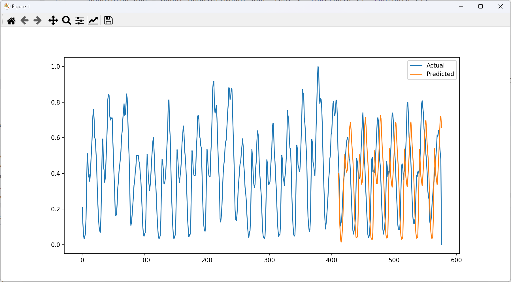 
  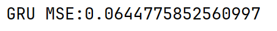 