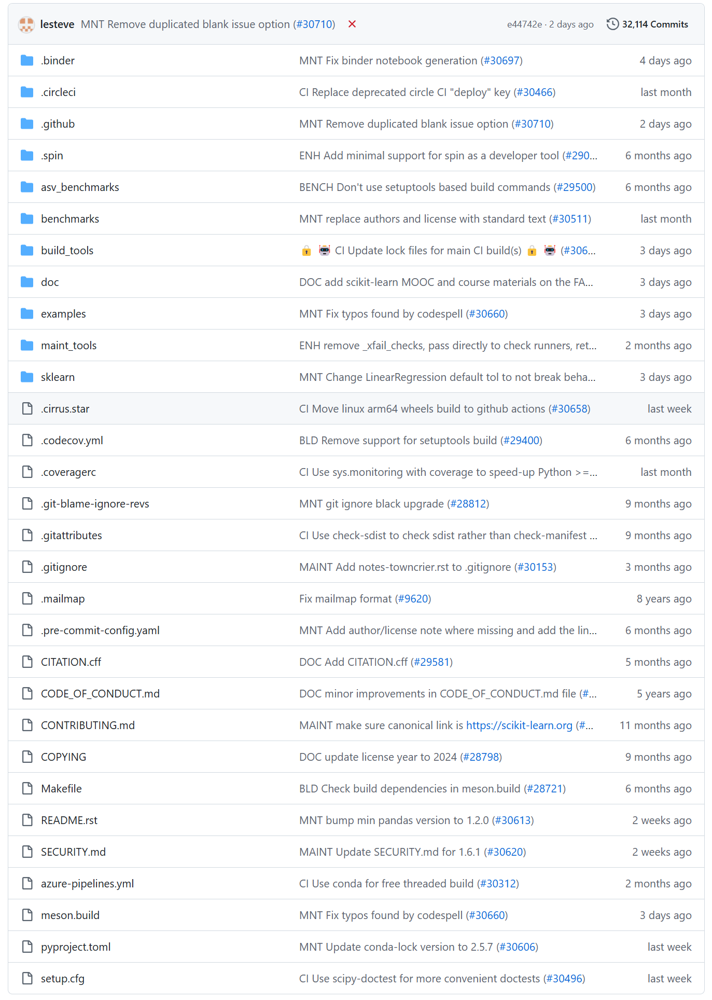
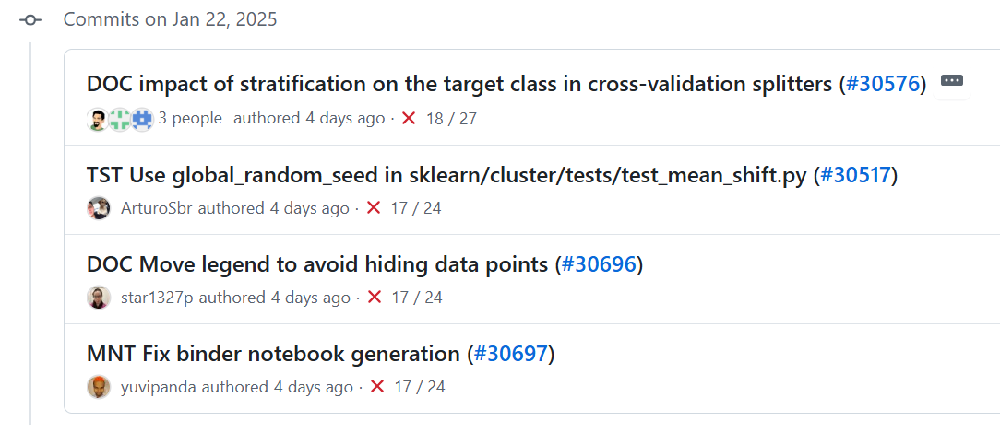

# Scikit-learn_Analysis
***
## 题目：针对Scikit-learn仓库的分析和应用
### 项目简介
- 共创者：李忠赫、程泽、莫竣凯、闵子洋、王紫怡
- 研究方向：分析Scikit-learn仓库的结构、1月16日-1月22日的仓库提交信息、sklearn库的应用及使用技巧
- 此仓库的`LZH`文件夹、`MZY`文件夹、`WZY`文件夹内包含共创者对于sklearn库的实操应用和使用技巧的代码贡献
- 此仓库的`Analysis`文件夹内包含对仓库结构和提交信息的分析
***
### sklearn仓库背景介绍
- scikit-learn(简称sklearn)是机器学习领域中最受欢迎的Python库之一。该库的开发始于2007年， 当时是David Cournapeau的Google Summer of Code项目。那年晚些时候，Matthieu Brucher开始研究这个项目，并作为他论文的一部分
- 2010年，Fabian Pedregosa、Gael Varoquaux、Alexandre Gramfort和Vincent Michel领导了INRIA项目，并于2010年2月1日发布了第一个公开版本。从那时起，大约3个月的周期出现了几个版本，蓬勃发展的国际社区一直在领导开发工作
- 21 世纪以来，机器学习领域快速发展，新算法不断涌现，如支持向量机、随机森林、梯度提升等。不同算法适用于不同场景，开发者需一个集中平台，方便获取和使用各类算法。例如，在处理高维数据分类时，支持向量机效果良好；而处理大规模数据回归问题，随机森林可能更合适。sklearn将这些算法整合，为开发者提供统一接口。除此之外，机器学习应用领域不断拓展，涵盖计算机视觉、自然语言处理、生物信息学等，由于各领域对机器学习工具需求不同，sklearn旨在满足多样化需求，提供通用且灵活的机器学习框架。比如在图像分类中，可利用sklearn的分类算法对图像特征进行分类；在自然语言处理中，用于文本分类和聚类
***
### sklearn仓库结构简析
Scikit-learn的官方代码库结构组织有序，涵盖项目配置、基准测试、工具、文档、示例和核心代码等多个关键部分，为项目的开发、维护和使用提供便利 
 
***
### sklearn仓库历史提交信息简析
我们聚焦于scikit-learn仓库从2025年1月16日到1月22日这七天的历史提交信息，scikit-learn仓库十分活跃，提交信息数量可观且种类繁多，涵盖文档完善、测试优化、代码修复、功能增强和CI配置更新等方面。这从多维度推动项目发展，确保其稳定性、易用性和功能性不断提升 
 